# MSDP

Ingestion-платформа: несколько источников → Kafka / NiFi → MongoDB + Parquet, плюс мониторинг и логирование.

Пет-проект по курсу Data Engineer. Здесь только то, что нужно, чтобы поднять стек у себя. 
 
---

## Что понадобится

- Docker Desktop (WSL2 backend на Windows)
- **минимум 8 GB RAM** под Docker (NiFi, Elasticsearch и Hadoop жрут много)
- 10+ GB свободного места
- Git, если клонируешь репозиторий

Python и venv нужны только если хочешь гонять скрипты с хоста. Внутри Compose они уже крутятся в контейнерах.

---

## Быстрый старт

```bash
cd docker
cp .env.example .env   # если ещё нет; пароли демо можно не менять
docker compose up -d
```

Первый запуск долгий: качает образы (Kafka, NiFi, Grafana и т.д.). Может занять 5–15 минут.

Проверка:

```bash
docker compose ps
```

Почти всё должно быть `Up` / `healthy`.  
`loki` иногда стартует с задержкой — подожди минуту.

Опционально EFK (Elasticsearch + Fluentd + Kibana):

```bash
docker compose --profile elk up -d
```

Опционально Hadoop (HDFS + YARN, single-node):

```bash
docker compose --profile hadoop up -d
```

---

## Куда стучаться

> Логины ниже — демо для локального запуска. В проде смени через `.env`.

| Что | Адрес | Логин |
|-----|-------|-------|
| Grafana | http://localhost:3001 | admin / admin |
| NiFi | http://localhost:8080/nifi | admin / admin1234567890 |
| NiFi Registry | http://localhost:18081/nifi-registry | — |
| Prometheus | http://localhost:9091 | — |
| Alertmanager | http://localhost:9095 | — |
| Kibana (profile `elk`) | http://localhost:5601 | — |
| Elasticsearch (profile `elk`) | http://localhost:9200 | — |
| HDFS NameNode (profile `hadoop`) | http://localhost:9870 | — |
| YARN ResourceManager (profile `hadoop`) | http://localhost:18088 | — |
| MapReduce History (profile `hadoop`) | http://localhost:8188 | — |

Порты сдвинуты (3001, 9091, 9095, 8088, 18088…), чтобы меньше конфликтовать с тем, что уже занято на машине.

---

## Как выглядит

### Стек в Docker

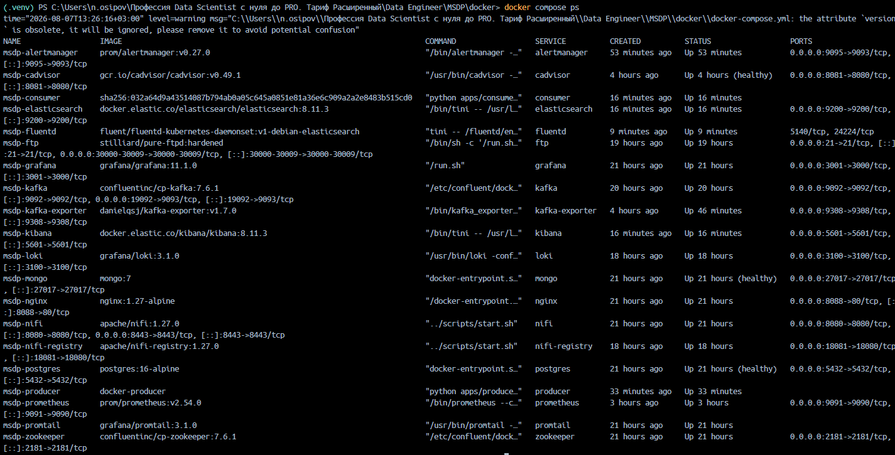

### Grafana — обзор стека

CPU, память Docker, статус сервисов, логи.

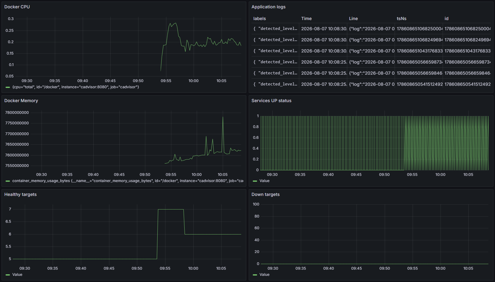

### Kafka — топики и consumer lag

Видно `iss-position`, `cdc-events`, `nifi-events`.

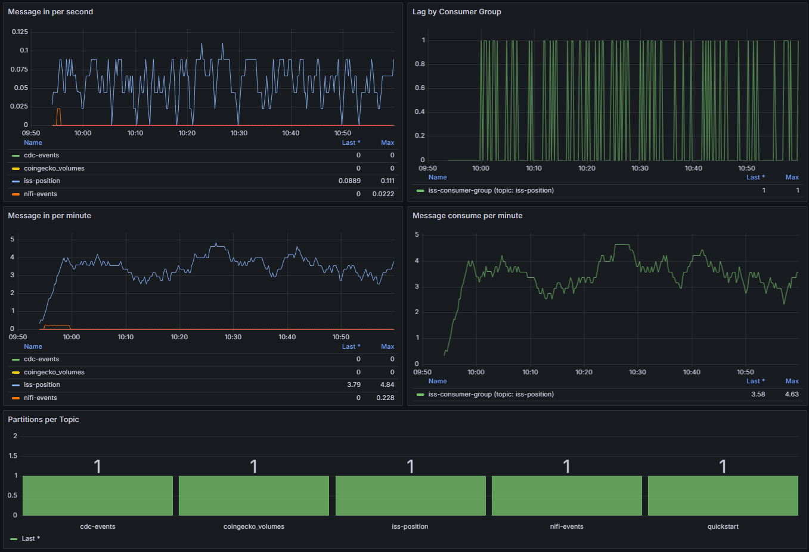

### Prometheus — targets

cAdvisor и Kafka Exporter в статусе UP.

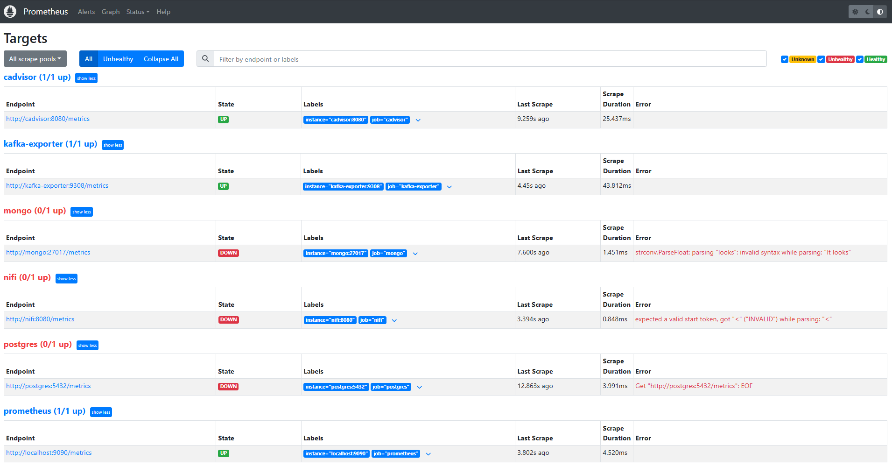

### Алерты

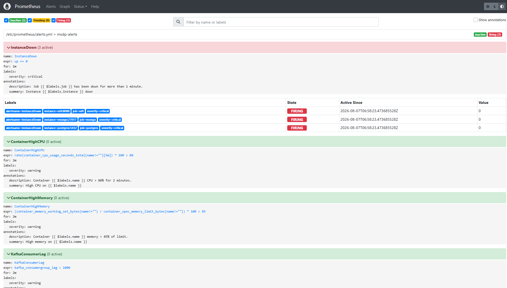

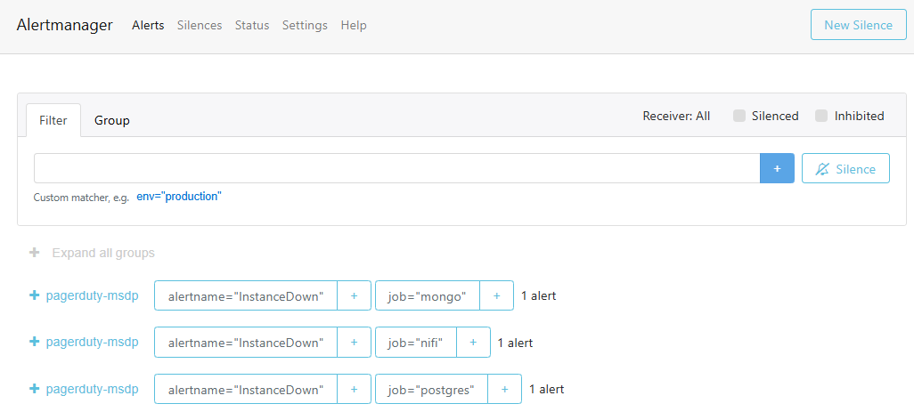

### NiFi — ingestion flows

HTTP API, ExecuteSQL, FTP → файл / Kafka.

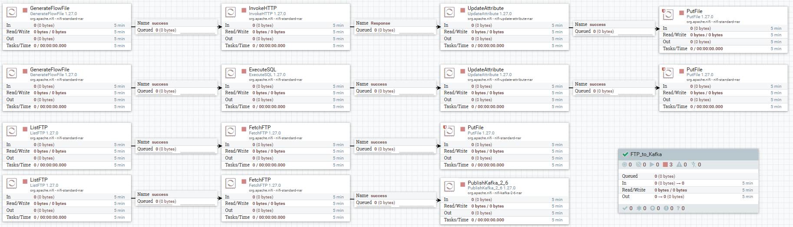

### Structlog — producer / consumer

JSON-логи в stdout.

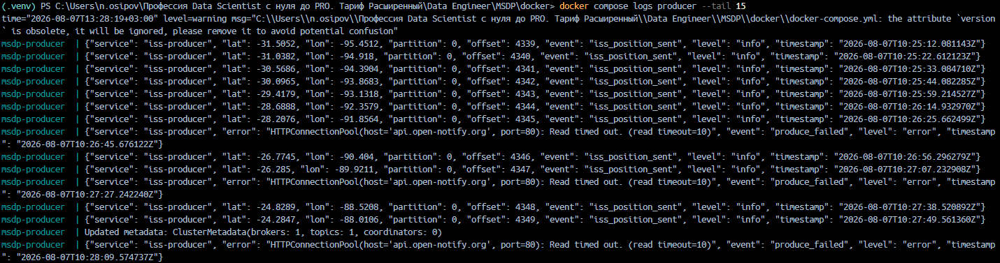

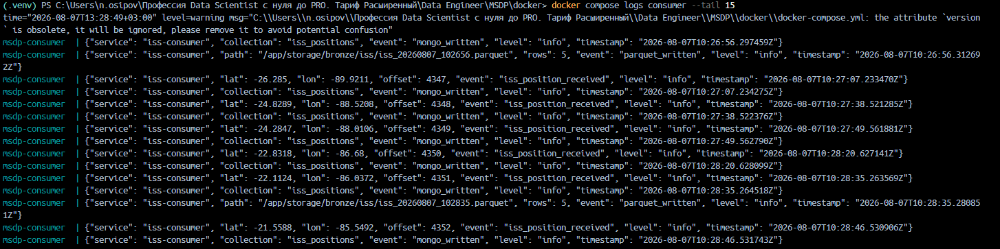

### Loguru — pull из Postgres

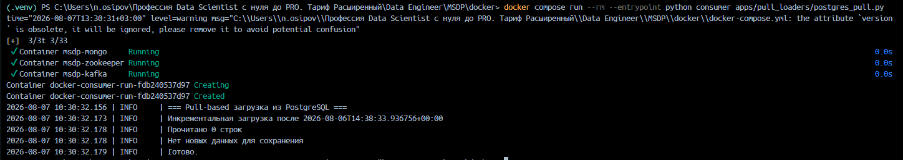

### Данные: Mongo и Bronze

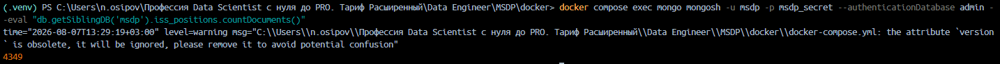

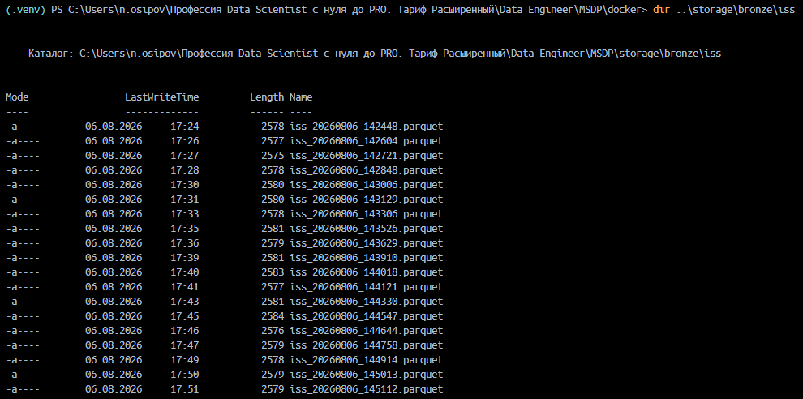

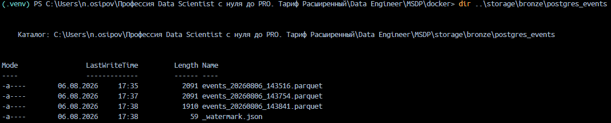


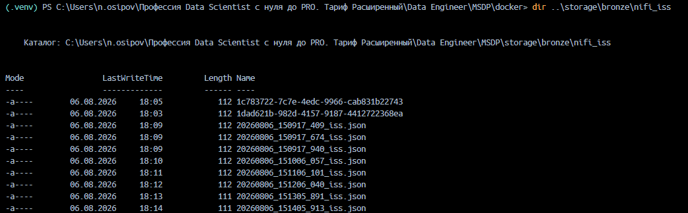

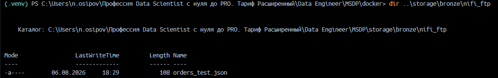

### EFK — Kibana Discover

Loguru → файл → Fluentd → Elasticsearch → Kibana.

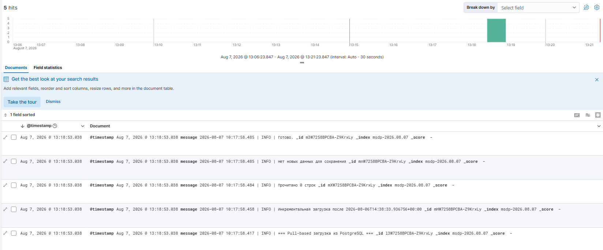

### Hadoop (профиль `hadoop`)

HDFS NameNode и YARN ResourceManager (single-node: 1 NN + 1 DN + YARN).

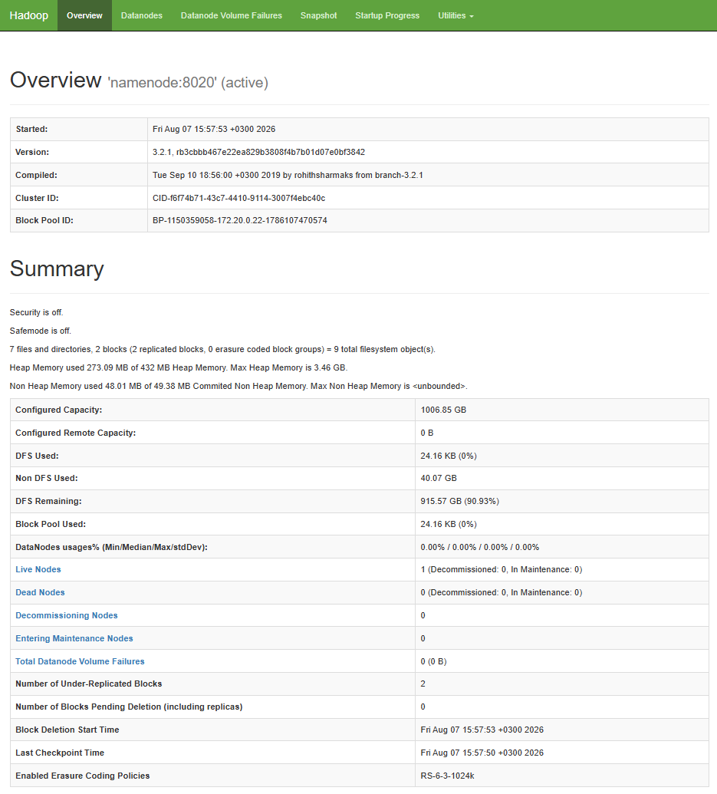

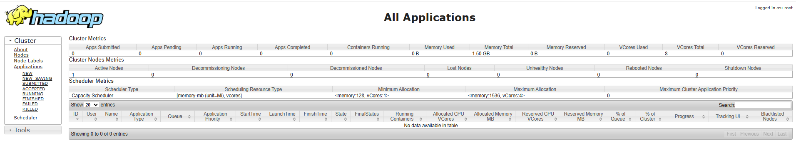

```bash
docker compose --profile hadoop up -d
# HDFS:  http://localhost:9870
# YARN:  http://localhost:18088
```

Практика: WordCount через MapReduce Streaming (Python). Скрипты — `hadoop/streaming/wordcount/`, данные — `hadoop/data/`.

---

## Что уже работает после `up -d`

1. **Producer** пишет координаты МКС в Kafka (`iss-position`), логи — **structlog** (JSON)
2. **Consumer** читает топик → MongoDB + Parquet в `storage/bronze/iss/`
3. **Мониторинг**: Prometheus, Grafana, Loki, Alertmanager, cAdvisor, Kafka Exporter

Логи:

```bash
docker compose logs -f producer
docker compose logs -f consumer
```

Mongo:

```bash
docker compose exec mongo mongosh -u msdp -p msdp_secret --authenticationDatabase admin \
  --eval "db.getSiblingDB('msdp').iss_positions.countDocuments()"
```

Файлы:

```bash
dir storage\bronze\iss          # Windows
ls storage/bronze/iss           # Linux/macOS
```

---

## Остальные пайплайны (запуск руками)

### Pull из Postgres

Сид, если таблица пустая:

```bash
docker compose exec -T postgres psql -U msdp -d msdp -f /docker-entrypoint-initdb.d/02_seed.sql
```

Загрузка (loguru → stdout и `storage/logs/postgres_pull.log`):

```bash
docker compose run --rm --entrypoint python consumer apps/pull_loaders/postgres_pull.py
```

Результат: `storage/bronze/postgres_events/`, watermark в `_watermark.json`.

### CDC

Триггеры: `databases/postgres/init/03_cdc.sql`.

```bash
docker compose exec postgres psql -U msdp -d msdp -c \
  "INSERT INTO raw.events (event_type, payload) VALUES ('purchase', jsonb_build_object('order_id', 999, 'amount', 100));"

docker compose run --rm --entrypoint python consumer apps/pull_loaders/cdc_to_kafka.py
```

События уходят в Kafka (`cdc-events`) и в `storage/bronze/cdc_events/`.

### NiFi

UI: http://localhost:8080/nifi

Flows на canvas:
- HTTP API → файл (`bronze/nifi_iss`)
- FTP → файл / Kafka (`bronze/nifi_ftp`, топик `nifi-events`)
- ExecuteSQL → файл (`bronze/nifi_postgres`)

FTP: `localhost:21`, пользователь `msdp` / `msdp_secret`.  
Тестовые файлы — в `storage/ftp_inbox/`.

### Hadoop WordCount (профиль `hadoop`)

```bash
docker compose --profile hadoop up -d
```

Python 3 в namenode (один раз, образ на EOL Stretch):

```bash
docker compose exec namenode bash -c "echo 'deb http://archive.debian.org/debian stretch main' > /etc/apt/sources.list && echo 'deb http://archive.debian.org/debian-security stretch/updates main' >> /etc/apt/sources.list && apt-get -o Acquire::Check-Valid-Until=false update && apt-get -o Acquire::Check-Valid-Until=false install -y python3"
```

Job:

```bash
docker compose exec namenode bash -c "\
  cp /streaming/wordcount/mapper.py /tmp/mapper.py && \
  cp /streaming/wordcount/reducer.py /tmp/reducer.py && \
  sed -i 's/\r$//' /tmp/mapper.py /tmp/reducer.py && \
  hdfs dfs -mkdir -p /wordcount/input && \
  hdfs dfs -put -f /data/wordcount.txt /wordcount/input/ && \
  hdfs dfs -rm -r -f /wordcount/output && \
  mapred streaming \
    -files /tmp/mapper.py,/tmp/reducer.py \
    -input /wordcount/input \
    -output /wordcount/output \
    -mapper 'python3 mapper.py' \
    -reducer 'python3 reducer.py' && \
  hdfs dfs -cat /wordcount/output/part-00000"
```

Остановить Hadoop:

```bash
docker compose --profile hadoop stop
```

---

## Логирование

| Инструмент | Где |
|------------|-----|
| **structlog** | `iss_producer`, `iss_consumer` — JSON в stdout |
| **loguru** | `postgres_pull` — текст в stdout + файл |
| **Loki + Promtail** | логи контейнеров → Grafana Explore |
| **EFK** | Fluentd tail `storage/logs` → Elasticsearch → Kibana (`profile: elk`) |

Поднять EFK:

```bash
docker compose --profile elk up -d
```

Kibana: data view `msdp-*`, Discover.

Остановить, чтобы освободить RAM:

```bash
docker compose --profile elk stop
```

---

## Мониторинг

- Grafana → **MSDP Overview**, Kafka dashboard (ID 7589)
- Prometheus rules: http://localhost:9091/rules — группа `msdp-alerts`
- Alertmanager: http://localhost:9095  
  Receiver настроен на **PagerDuty** (Events API V2). Ключ — в `monitoring/alertmanager/pagerduty_key` (не в git).  
  Доставка инцидентов зависит от исходящего доступа к `events.pagerduty.com` (в корпоративной сети часто режется SSL/firewall).

Примеры PromQL:

```promql
up
count(up)
container_memory_usage_bytes{id="/docker"}
rate(container_cpu_usage_seconds_total{id="/docker"}[1m])
```

---

## Если что-то не поднимается

**Порт занят**

```bash
netstat -an | findstr "3001 9091 9092 8080 5601 9200 9870 18088"
```

Поменяй проброс в `docker-compose.yml`.

**Kafka**  
Из контейнеров bootstrap: `kafka:9092`. С хоста: `localhost:9092` / `localhost:19092`.

**NiFi** стартует 1–3 минуты — смотри `docker compose logs nifi`.

**Loki Restarting** — в конфиге 3.x не должно быть устаревших полей вроде `max_look_back_period`.

**Мало RAM**

```bash
docker compose stop nifi nifi-registry
docker compose --profile elk stop
docker compose --profile hadoop stop
```

**SSL / InfoWatch** при сборке образов или gem/pip — типично для корп. сети; используй `--trusted-host` / готовые image с плагинами.

**Hadoop Streaming и Windows volumes** — копируй mapper/reducer во `/tmp` внутри namenode перед `-files` (см. команду WordCount выше).

---

## Остановка

```bash
cd docker
docker compose down
docker compose --profile elk down      # если поднимал EFK
docker compose --profile hadoop down   # если поднимал Hadoop
```

С данными volumes:

```bash
docker compose down -v
```

---

## Структура

```text
MSDP/
├── apps/
│   ├── logging_setup.py          # structlog
│   ├── Dockerfile
│   ├── producers/iss_producer.py
│   ├── consumers/iss_consumer.py
│   └── pull_loaders/
│       ├── postgres_pull.py      # loguru
│       └── cdc_to_kafka.py
├── databases/postgres/init/
├── docker/docker-compose.yml
├── hadoop/
│   ├── hadoop.env
│   ├── data/                     # wordcount.txt, csv
│   └── streaming/                # mapper/reducer
├── monitoring/
│   ├── prometheus/
│   ├── grafana/
│   ├── loki/
│   ├── promtail/
│   ├── alertmanager/
│   └── fluentd/
├── storage/
│   ├── bronze/
│   └── logs/                     # для Fluentd
├── docs/
│   ├── architecture.md
│   └── screenshots/
└── README.md
```

Потоки данных подробнее: [docs/architecture.md](docs/architecture.md).
