# OrbitData Platform

Итоговый проект курса **Data Engineer** (Skillbox).

Полноценная локальная data-платформа: три домена источников, Kafka, Data Lake (Bronze → Silver → Gold), Data Vault, real-time путь в ClickHouse, оркестрация Airflow, качество данных (Great Expectations + PyTest), мониторинг и Hadoop/ELK-стек.

Репозиторий рассчитан на запуск через Docker Compose на Windows (Docker Desktop + WSL2).

---

## Содержание

1. [О проекте](#о-проекте)
2. [Архитектура](#архитектура)
3. [Домены данных](#домены-данных)
4. [Стек технологий](#стек-технологий)
5. [Структура репозитория](#структура-репозитория)
6. [Требования](#требования)
7. [Запуск](#запуск)
8. [Доступы к сервисам](#доступы-к-сервисам)
9. [Поток данных](#поток-данных)
10. [Слои Data Lake](#слои-data-lake)
11. [Data Vault](#data-vault)
12. [Оркестрация и качество](#оркестрация-и-качество)
13. [Демонстрация](#демонстрация)
14. [Покрытие навыков курса](#покрытие-навыков-курса)
15. [Известные ограничения](#известные-ограничения)

---

## О проекте

Задача — собрать end-to-end платформу, которая:

- принимает события из нескольких источников;
- доставляет их через Kafka;
- сохраняет сырые данные в Data Lake (Bronze);
- очищает и типизирует (Silver);
- строит витрины и Data Vault (Gold);
- параллельно пишет данные в ClickHouse для аналитики почти в реальном времени;
- оркестрирует batch-шаги через Airflow;
- проверяет качество данных;
- даёт мониторинг метрик и логов.

Всё разворачивается одним `docker-compose` с профилями для тяжёлых компонентов (Spark, Airflow, Hadoop, ELK).

---

## Архитектура

```
┌─────────────────────────────────────────────────────────────┐
│                     ИСТОЧНИКИ                                │
│  ISS API  │  Banking simulator  │  Industrial IoT sensors   │
└─────────────┬───────────────┬───────────────┬───────────────┘
              │               │               │
              ▼               ▼               ▼
        space.iss.position  banking.transactions  industrial.sensors
              │               │               │
              └───────────────┼───────────────┘
                              ▼
                           Kafka
                     ┌────────┴────────┐
                     │                 │
                     ▼                 ▼
              bronze-consumer    clickhouse-consumer
                     │                 │
                     ▼                 ▼
            storage/bronze/        ClickHouse
            (Parquet)           (iss_position,
                     │           transactions,
                     ▼           sensors)
                 Spark
            silver_job.py
                     │
                     ▼
            storage/silver/
                     │
                     ▼
            gold_job.py + data_vault.py
                     │
                     ▼
            storage/gold/
            (витрины, Hub/Sat/Link,
             CSV, Avro)
                     │
                     ▼
            Airflow DAG
            Great Expectations
            PyTest
```

Параллельно:

- NiFi — альтернативный ingestion (GenerateFlowFile → PutFile);
- HDFS — директория `/orbitdata/bronze`;
- Prometheus / Grafana / cAdvisor / Loki — метрики и логи;
- Elasticsearch / Logstash / Kibana — ELK.

---

## Домены данных

| Домен | Источник | Kafka-топик | Пример полей |
|-------|----------|-------------|--------------|
| **Space** | Open Notify ISS API | `space.iss.position` | latitude, longitude, event_time |
| **Banking** | Симулятор транзакций | `banking.transactions` | client_id, amount, currency, status |
| **Industrial** | Симулятор IoT-датчиков | `industrial.sensors` | equipment_id, temperature_c, vibration_mm_s, status |

Producers пишут JSON в Kafka. Consumers читают независимо: один путь — в Parquet (Bronze), второй — в ClickHouse.

---

## Стек технологий

| Категория | Технологии |
|-----------|------------|
| Транспорт | Kafka, Zookeeper |
| Ingestion | Python producers/consumers, NiFi |
| Data Lake | Parquet, CSV, Avro, локальное хранилище + HDFS |
| Обработка | Spark 3.5 (DataFrame API, Spark SQL) |
| OLAP | ClickHouse |
| OLTP / метаданные | PostgreSQL |
| NoSQL | MongoDB |
| Оркестрация | Airflow 2.9 (LocalExecutor) |
| Качество данных | Great Expectations, PyTest, Pandas |
| Моделирование | Data Vault (Hub, Satellite, Link), витрины Gold |
| Hadoop | HDFS, YARN, History Server |
| Мониторинг | Prometheus, Grafana, cAdvisor, Kafka Exporter |
| Логи | Loki, Promtail, ELK (Elasticsearch, Logstash, Kibana) |
| Инфраструктура | Docker, Docker Compose |

Greenplum в локальный стенд не входил: для него мало RAM. Роль MPP OLAP закрыта ClickHouse.

---

## Структура репозитория

```
OrbitData Platform/
├── apps/
│   ├── producers/           # iss_producer, banking_producer, industrial_producer
│   ├── consumers/           # bronze_consumer, clickhouse_consumer
│   ├── quality/             # validate_silver.py, export_avro.py
│   ├── Dockerfile
│   └── requirements.txt
├── spark/jobs/
│   ├── silver_job.py
│   ├── gold_job.py
│   ├── data_vault.py
│   ├── register_hive_tables.py
│   └── export_csv.py
├── airflow/dags/
│   ├── orbitdata_pipeline.py      # полный pipeline
│   └── orbitdata_bronze_check.py
├── storage/
│   ├── bronze/{space,banking,industrial}/
│   ├── silver/{space,banking,industrial}/
│   ├── gold/
│   │   ├── banking_client_stats/
│   │   ├── industrial_equipment_stats/
│   │   ├── space_hourly_position/
│   │   ├── data_vault/{hub_client,sat_*,link_*}
│   │   └── exports/{banking_csv,banking_avro}/
│   └── logs/
├── monitoring/
│   ├── prometheus/
│   ├── grafana/
│   ├── loki/
│   ├── promtail/
│   ├── alertmanager/
│   └── logstash/pipeline/
├── databases/
│   └── clickhouse/init/
├── nifi/flows/
├── tests/
│   ├── test_validate_silver.py
│   └── test_airflow_dag.py
├── docs/screenshots/
├── docker-compose.yml
├── .env.example
└── README.md
```

---

## Требования

- Docker Desktop (Windows) с WSL2
- ~12–16 GB RAM (при включении Hadoop + ELK + Spark)
- Свободные порты: 2181, 3001, 3100, 5432, 5601, 8080–8083, 8123, 9000, 9091, 9092, 9200, 9870, 18088 и др. (см. `docker-compose.yml`)

---

## Запуск

```powershell
# 1. Клонировать репозиторий и перейти в каталог проекта

# 2. Скопировать переменные окружения
copy .env.example .env

# 3. Базовый стек (Kafka, БД, NiFi, мониторинг)
docker compose up -d

# 4. Тяжёлые профили по необходимости
docker compose --profile spark --profile airflow up -d
docker compose --profile hadoop up -d
docker compose --profile elk up -d
```

Остановка генераторов данных (чтобы не грузить машину):

```powershell
docker compose stop iss-producer banking-producer industrial-producer bronze-consumer clickhouse-consumer
```

---

## Доступы к сервисам

| Сервис | URL | Учётные данные |
|--------|-----|----------------|
| Airflow | http://localhost:8082 | admin / admin |
| Grafana | http://localhost:3001 | admin / admin |
| Spark Master UI | http://localhost:8083 | — |
| NiFi | http://localhost:8080 | admin / admin1234567890 |
| NiFi Registry | http://localhost:18081 | — |
| Prometheus | http://localhost:9091 | — |
| cAdvisor | http://localhost:8081 | — |
| Kibana | http://localhost:5601 | — |
| Elasticsearch | http://localhost:9200 | — |
| HDFS NameNode | http://localhost:9870 | — |
| YARN ResourceManager | http://localhost:18088 | — |
| Hadoop History Server | http://localhost:8188 | — |
| ClickHouse HTTP | http://localhost:8123 | orbit / orbit_secret |
| PostgreSQL | localhost:5432 | orbit / orbit_secret / db: orbitdata |
| MongoDB | localhost:27017 | orbit / orbit_secret |
| Kafka (с хоста) | localhost:19092 | — |

---

## Поток данных

### Batch-путь

1. Producers пишут события в Kafka.
2. `bronze-consumer` читает топики и пишет Parquet в `storage/bronze/<domain>/`.
3. `silver_job.py` читает Bronze, чистит, приводит типы, убирает дубли → `storage/silver/`.
4. `gold_job.py` считает агрегаты → витрины в `storage/gold/`.
5. `data_vault.py` строит Hub / Satellite / Link.
6. `export_csv.py` / `export_avro.py` выгружают banking в CSV и Avro.
7. Airflow DAG `orbitdata_full_pipeline` связывает проверку Bronze и шаги Silver/Gold.

### Real-time путь

1. Тот же Kafka.
2. `clickhouse-consumer` пишет в таблицы `orbitdata.iss_position`, `transactions`, `sensors`.
3. Аналитика доступна сразу через `clickhouse-client` или HTTP-интерфейс.

### Альтернативный ingestion

NiFi flow: `GenerateFlowFile` → `UpdateAttribute` → `PutFile` (демо-файлы в bronze/nifi).

---

## Слои Data Lake

| Слой | Содержимое | Формат |
|------|------------|--------|
| **Bronze** | Сырые JSON-события как есть | Parquet |
| **Silver** | Типизация, not-null фильтры, дедуп по event_id | Parquet |
| **Gold** | Бизнес-агрегаты по клиентам, оборудованию, часам | Parquet |
| **Exports** | Выгрузки для обмена | CSV, Avro |

Пример Gold:

- `banking_client_stats` — tx_count, total_amount, avg_amount по client_id / currency / status
- `industrial_equipment_stats` — avg/max temperature, vibration, power
- `space_hourly_position` — средние координаты МКС по часам

---

## Data Vault

Для banking-домена:

| Таблица | Роль |
|----------|------|
| `hub_client` | Бизнес-ключ клиента (client_id + hash key) |
| `sat_client_details` | Атрибуты клиента (tx_count, total_amount, currency) + hashdiff |
| `link_transaction` | Связь client ↔ transaction |
| `sat_transaction` | Детали транзакции (type, amount, status) |

Файлы: `storage/gold/data_vault/`.

---

## Оркестрация и качество

**Airflow DAG** `orbitdata_full_pipeline`:

```
check_bronze → run_silver → run_gold → final_summary
```

**Great Expectations** — проверки Silver (not null, ranges, allowed values, uniqueness).

**PyTest**:

- `test_validate_silver.py` — GE-валидация отрабатывает без падения
- `test_airflow_dag.py` — DAG-файл на месте, task_id на месте

```powershell
docker compose run --rm --no-deps `
  -v ${PWD}/storage:/data `
  -v ${PWD}/tests:/tests `
  iss-producer pytest /tests -v
```

---

## Демонстрация

Ниже — последовательность, которой удобно пользоваться на защите. Скриншоты лежат в `docs/screenshots/`.

### Шаг 1. Источники → Kafka

```powershell
docker compose start iss-producer banking-producer industrial-producer
docker compose logs iss-producer banking-producer industrial-producer --tail=8
docker compose stop iss-producer banking-producer industrial-producer
```


### Шаг 2. Топики Kafka

```powershell
docker compose exec kafka kafka-topics --bootstrap-server kafka:9092 --list

docker compose exec kafka kafka-console-consumer --bootstrap-server kafka:9092 --topic banking.transactions --from-beginning --max-messages 3
```


### Шаг 3. Bronze

```powershell
Get-ChildItem storage\bronze\space\*.parquet | Select-Object -First 1 | Format-List FullName, Length, LastWriteTime
Get-ChildItem storage\bronze\banking\*.parquet | Select-Object -First 1 | Format-List FullName, Length, LastWriteTime
Get-ChildItem storage\bronze\industrial\*.parquet | Select-Object -First 1 | Format-List FullName, Length, LastWriteTime
```

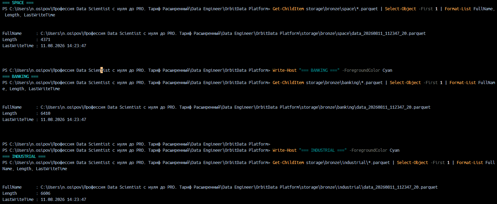

### Шаг 4. Silver, Gold, Data Vault, CSV, Avro

```powershell
Get-ChildItem storage\silver -Directory
Get-ChildItem storage\gold -Directory
Get-ChildItem storage\gold\data_vault -Directory
Get-ChildItem storage\gold\exports -Recurse -File
```

,%20CSV%20и%20Avro.png)

### Шаг 5. Spark SQL (Hive-стиль)

```powershell
docker compose exec spark-master /opt/spark/bin/spark-submit --master spark://spark-master:7077 --deploy-mode client /opt/spark/work-dir/jobs/register_hive_tables.py
```


### Шаг 6. ClickHouse

```powershell
docker compose exec clickhouse clickhouse-client --user orbit --password orbit_secret -q "SHOW TABLES FROM orbitdata"
docker compose exec clickhouse clickhouse-client --user orbit --password orbit_secret -q "SELECT count() FROM orbitdata.transactions"
docker compose exec clickhouse clickhouse-client --user orbit --password orbit_secret -q "SELECT client_id, count() as tx, round(sum(amount),2) as total FROM orbitdata.transactions GROUP BY client_id ORDER BY total DESC LIMIT 5"
```

.png)

### Шаг 7. Airflow

http://localhost:8082 — логин `admin` / `admin`  
DAG: `orbitdata_full_pipeline`

.png)

### Шаг 8. Мониторинг

**Prometheus** — http://localhost:9091

- `up`
- `container_memory_usage_bytes`
- `kafka_brokers`

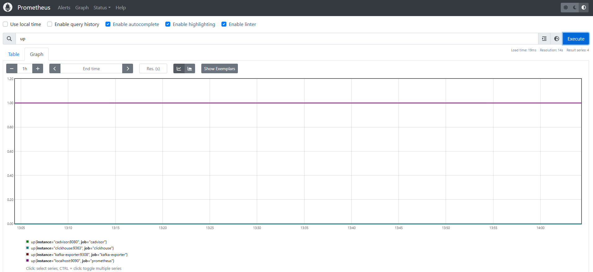

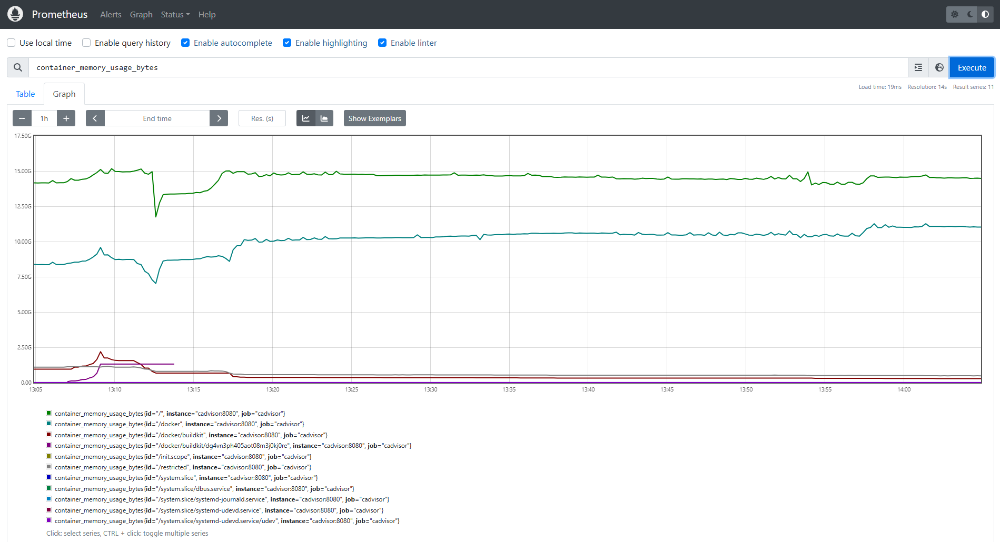

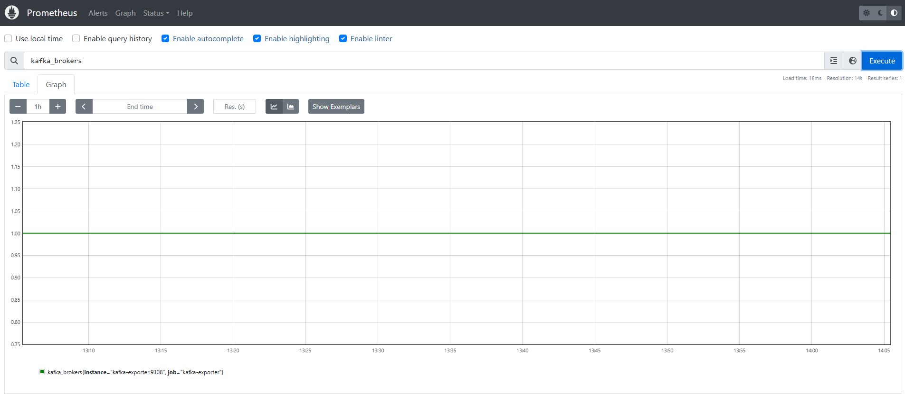

**Grafana** — http://localhost:3001 (`admin` / `admin`)

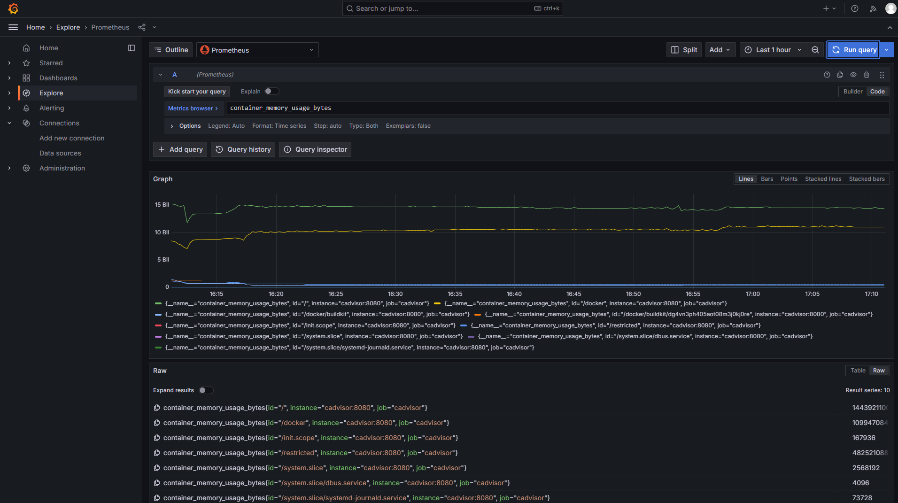

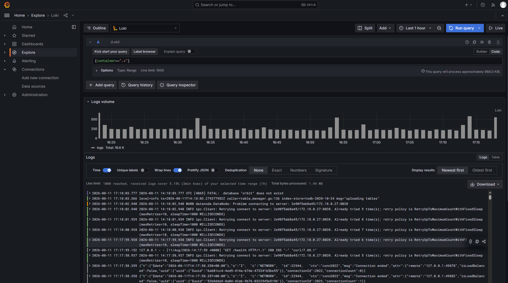

### Шаг 9. cAdvisor

http://localhost:8081

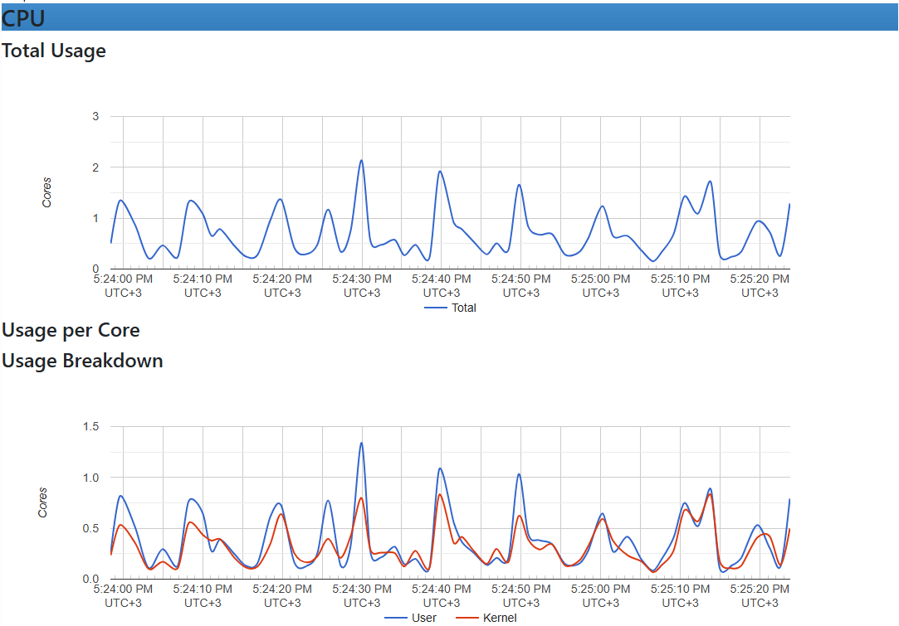

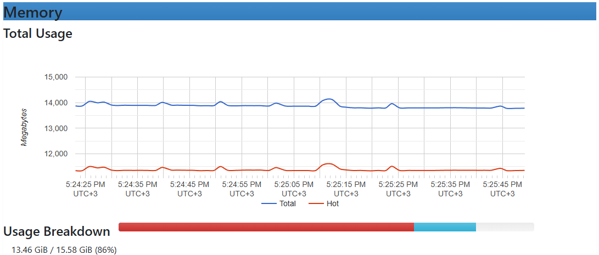

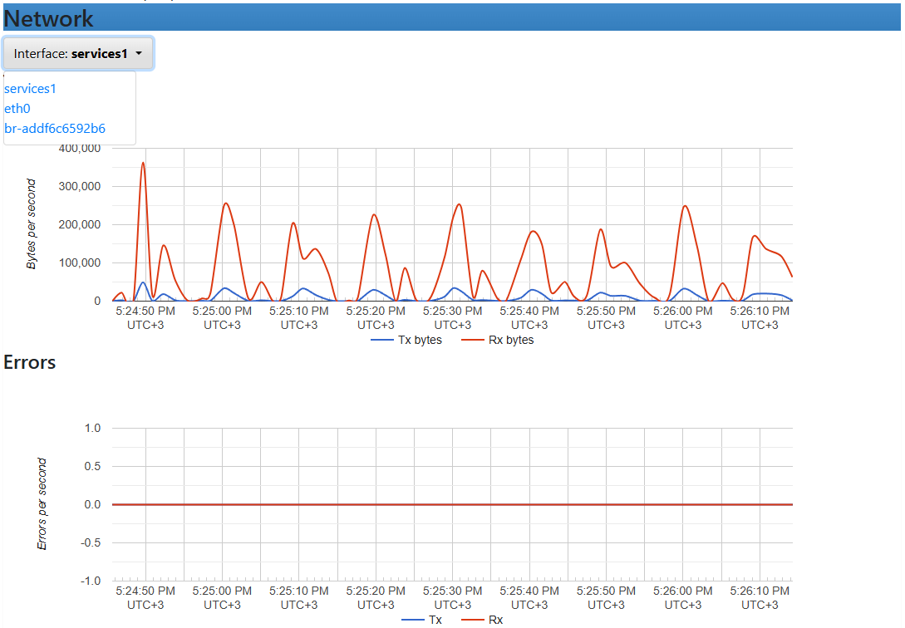

### Шаг 10. Kibana / Elasticsearch

http://localhost:5601

Dev Tools:

```
GET _cluster/health
```

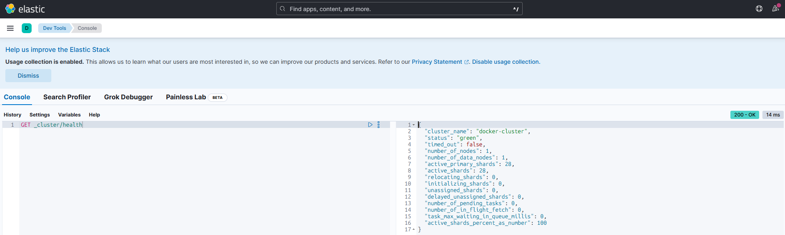

### Шаг 11. HDFS / YARN

```powershell
docker compose exec namenode hdfs dfs -ls /orbitdata
```

- NameNode: http://localhost:9870
- YARN: http://localhost:18088
- History Server: http://localhost:8188

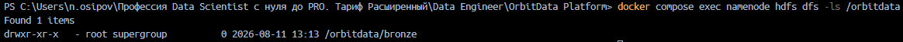


### Шаг 12. NiFi

http://localhost:8080

Process Group `OrbitData-Demo`: GenerateFlowFile → UpdateAttribute → PutFile.

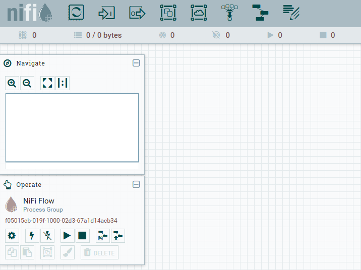

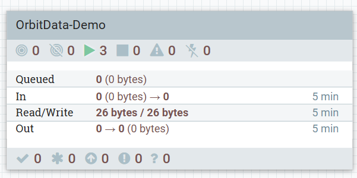

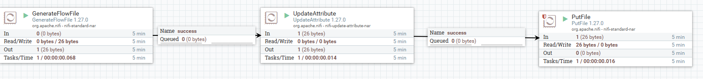

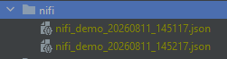

### Шаг 13. PyTest

```powershell
docker compose run --rm --no-deps `
  -v ${PWD}/tests:/tests `
  -v ${PWD}/airflow/dags:/opt/airflow/dags `
  iss-producer pytest /tests/test_airflow_dag.py -v
```

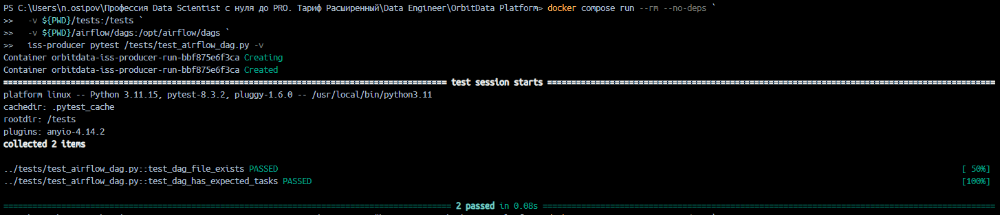

---

## Покрытие навыков курса

| Навык | Реализация в проекте |
|-------|----------------------|
| CSV | `storage/gold/exports/banking_csv/` |
| Parquet | Bronze / Silver / Gold / Data Vault |
| Avro | `storage/gold/exports/banking_avro/banking.avro` |
| Реляционные БД | PostgreSQL |
| NoSQL | MongoDB |
| ClickHouse | Таблицы + consumer + аналитические запросы |
| Kafka | 3 топика, producers, consumers |
| NiFi | UI + рабочий demo-flow |
| Docker | Весь стенд на Compose |
| Prometheus / Grafana | Метрики и дашборды |
| Elasticsearch / Kibana | Профиль `elk` |
| Logstash | Pipeline → индекс `orbitdata-logs` |
| Hadoop / HDFS / YARN | Профиль `hadoop`, UI, `/orbitdata` |
| Spark | silver / gold / data_vault / export / Spark SQL |
| Hive | Внешние таблицы через Spark SQL (`enableHiveSupport`) |
| Data Lake | Bronze → Silver → Gold |
| Data Warehouse / витрины | Gold-агрегаты |
| Data Vault | Hub, Satellite, Link |
| OLAP / OLTP | ClickHouse vs PostgreSQL |
| Airflow + DAG | `orbitdata_full_pipeline` |
| Great Expectations | Валидация Silver |
| PyTest | Тесты quality и DAG |
| Pandas | GE и export-скрипты |

---
